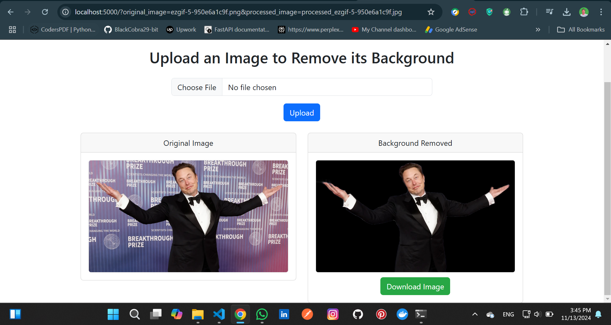

# Flask Image Background Remover

A Flask-based web application for removing backgrounds from images using Python. This project leverages image processing libraries to provide a simple, user-friendly tool for automatic background removal, making it perfect for e-commerce, graphic design, and other applications.

## Features

- **Automatic Background Removal**: Upload an image and remove its background with a single click.
- **Easy to Use**: Simple, intuitive web interface built with Flask.
- **Python-Powered**: Utilizes powerful image processing libraries such as `rembg` and `Pillow` for efficient background removal.
- **Customizable**: Modify the code to fit specific needs or integrate with other applications.

## Technologies Used

- **Flask**: A lightweight Python web framework for building the web app.

```bash
   pip install flask
```

- **rembg**: A Python library for automatic background removal using machine learning.

```bash
   pip install rembg
```

- **Pillow**: A Python Imaging Library (PIL) fork for image manipulation.

```bash
   pip install Pillow
```

- **HTML/CSS/JavaScript**: For building the front-end interface.

## Getting Started

### Prerequisites

- **Python 3.x**
- **pip** (Python package installer)

### Installation

1. Clone the repository:
   ```bash
   git clone https://github.com/BlackCobra29-bit/Flask-Image-Background-Remover.git

## Usage
1. **Upload an image with a background you’d like to remove.**
2. **Click the "Remove Background" button.**
3. **The app will process the image and display the result with a transparent background.**

## Output

